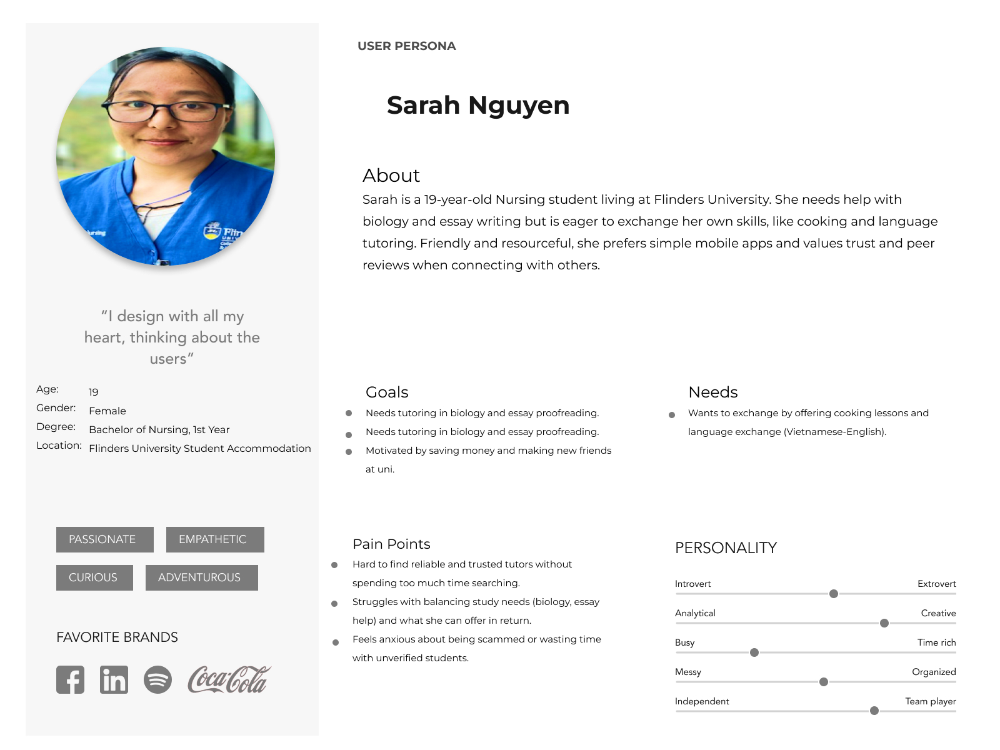

# COMP2030 User Research and Low Fidelity Design
Calen, Daniel, Freddy, Phat, Shudipta

## Project Proposal
## Website Concept: 
- We are planning to build a website which is a centralized digital platform where students and university staff can access and manage   academic information. This website content **student record, staff details and profile, academic content and important announcement**. Moreover, It can make seamless communication to the student and university. Finally, our website can track student performance and enrollment system. This website can store academic documents instead of paperwork. Students and University staff can adapt the new features which is digital first work flows. Besides offer students track their academic journey and notify about the future academic activities.
## Target Audience Profile:
- **Primary audiences are Students, Teachers and Academic Staff**. Students can access their academic progress, records and essential information. Teachers can publish result and monitors student performance. Academic staff can manage students details, setup academic information and enrollment. **Secondary Audiences can be IT team and software team who can fix any bugs and problems**. Moreover, help students to fix any issues in profile and management.
## Scope Statement: 
- In the scope statement part it based on few things such as **security or user authentication, student profile management, dashboard, Tuition fees, help and many more**. In the user authentication system student can secure their personal details and reset their password. Moreover, students can enable two factor authentication system to protect cyber attack. Besides, Student can change their name, details, contacts number and many more. Secondly, on dashboard section student can manage their notification system, see their time and dates of the class. Teachers can release grades and update learning materials.

## User Research Report

### 1.	Research Methods

To empathize with the target audience for **Flinders Uni Skill Share (FUSS)**, several methods were used such as observational studies (Government Digital Service, n.d.), interviews/surveys, and case studies (Nielsen & Loranger, n.d.):

- **Observation studies**: understand some ways that students are finding supportations  
  - **Action**: Where do students come if they have a problem? Can someone help them?  
  - **Example**: Library, Discords, Forum, Clubs, and AI  

- **Interviews & Surveys**: empathize with boundaries that inhibit students, through short talks with common questions to find problems that need solving.  
  - **Stakeholders**: Professors, Recruiters, Students  
  - **Thematic coding for Interview**:  
    - What is the biggest problem during learning skills of students?  
    - What skills are required in job applicants?  
    - How can I help you?  

- **Case studies**: some old problems that were solved could be helpful for new ones.  

- **Execution**: select 4–5 students’ journeys in one semester who have the same topics, schedule, and background (undergraduate/graduate).

### 2. User personas

### 3. Competitor Analysis  

- **LinkedIn Learning**  
  - **Strengths**: High-quality environment, many professional courses, well-structured certificates, supports career development.  
  - **Weaknesses**: Requires payment for professional content, low interactivity, focuses mainly on professional skills.  

- **Discord / WhatsApp Groups**  
  - **Strengths**: Free and easy to access, supports text/image/file sharing, real-time interactive communication, easy group formation.  
  - **Weaknesses**: Unstructured content, chaotic discussions.  

---

**References**  
- Government Digital Service. (n.d.). *Contextual research and observation*. GOV.UK Service Manual. [Link](https://www.gov.uk/service-manual/user-research/contextual-research-and-observation?utm_source=chatgpt.com)  
- Nielsen, J., & Loranger, H. (n.d.). *User research methods: A comprehensive guide*. Nielsen Norman Group. [PDF](https://media.nngroup.com/media/articles/attachments/User_Research_Methods_A4-compressed.pdf?utm_source=chatgpt.com)  

   

## Information Architecture

## Low-fidelity wireframes

[def]: image.png
